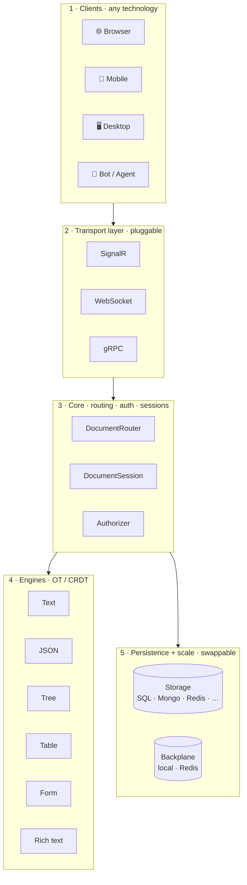
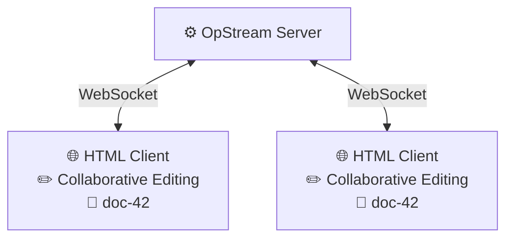
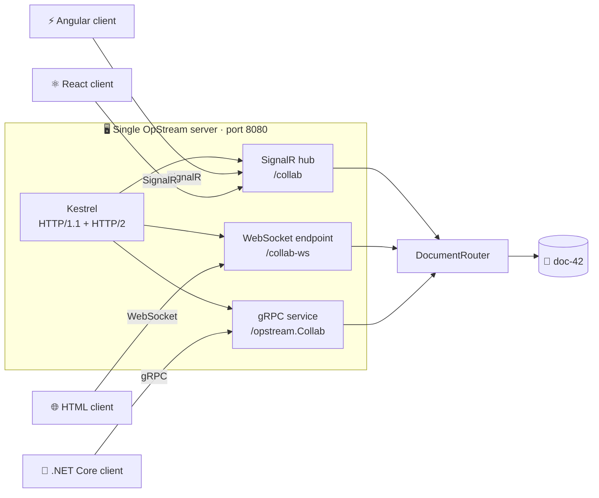
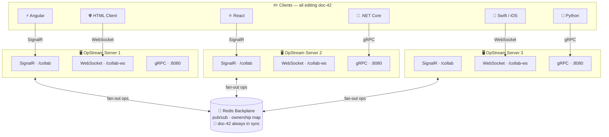
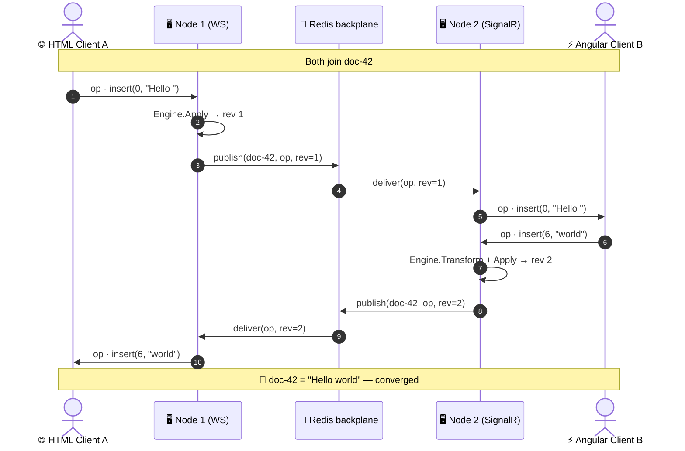

# Architecture

OpStream is built around one idea: **every layer is replaceable**. The transport
your clients speak, the storage that persists ops, the algorithm that merges
concurrent edits, the backplane that fans out across nodes — all of them sit
behind small interfaces you wire together with the standard ASP.NET Core DI
builder.

The result is a system that scales from a single Docker container serving two
browser tabs to a horizontally-scaled cluster fronting heterogeneous clients —
**without rewriting your application code**. You change configuration, not
architecture.

!!! tip "Three properties to keep in mind"
    - **Dynamic** — add transports, swap storage, enable the backplane at runtime via env vars or builder calls.
    - **Flexible** — mix engines, transports, and storage backends in any combination the matrix allows.
    - **Adaptable** — the server is .NET 9, but the wire protocol is plain JSON/Protobuf. **Clients can be written in anything.**

---

## The layered model

Every OpStream deployment, no matter how small or large, is the same five layers:



Each layer talks to the next through a small interface — `IDocumentTransport`,
`IOpEngine<TDoc, TOp>`, `IDocumentStore`, `IBackplane`. Replace one layer and
the others don't notice.

---

## Simplest deployment — one server, plain WebSockets

The minimum viable topology: a single `.NET` server with the in-memory store
and the local backplane, and two browsers connecting via raw WebSockets. No
infrastructure, no SignalR client library, **no .NET on the client** — just
HTML and JavaScript talking to a TCP socket.



This is exactly what you get from:

```bash
docker run --rm -p 8080:8080 opstreamcollab/opstream:latest
```

Perfect for prototyping, demos, and single-tenant edge boxes. **Zero
configuration.** The same image, with three environment variables changed,
becomes the cluster below.

---

## Multi-transport from a single process

OpStream's transports are independent — a single server process can listen on
**all three at once** on the same port. Kestrel is configured for
`Http1AndHttp2` everywhere, so SignalR (HTTP/1.1), WebSockets (HTTP/1.1), and
gRPC (HTTP/2) share the same TCP listener.



The router is transport-agnostic — by the time an op reaches it, it has been
normalized to the same wire model regardless of how it arrived. **A React app
on SignalR and a console tool on gRPC can collaborate on the same document
through the same process.**

Enable transports with a single env var:

```bash
docker run -p 8080:8080 \
  -e OPSTREAM__TRANSPORTS="signalr,websockets,grpc" \
  opstreamcollab/opstream:latest
```

---

## Scaling out — the full picture

When one node isn't enough, you add the **Redis backplane**. The backplane
does two things: fans operations out to peers connected to other nodes, and
coordinates *ownership* of each document so exactly one node is authoritative
at a time.

This diagram is the canonical "everything turned on" deployment: three
servers, every transport active, six client technologies, all editing the
same document, all kept in sync through Redis.



What this diagram is telling you:

- **Heterogeneous clients are first-class.** Six different stacks, three
  different wire protocols, one document. No "preferred client". No bridge
  service in between.
- **One server handles every transport simultaneously.** Each `OpStream
  Server` box is a single `dotnet` process exposing SignalR + WebSocket +
  gRPC at the same time.
- **The backplane is the only stateful piece.** Servers are stateless;
  Redis owns the cross-node coordination. Add or remove a node and the
  cluster reconfigures itself.
- **Eventual convergence is automatic.** Whether an edit comes in over
  gRPC on node 3 or WebSocket on node 1, every connected peer ends up on
  the same revision.

---

## The server is .NET — the clients are not

This is the property that opens up real adoption: **the OpStream server runs
on .NET 9, but nothing about its wire protocol requires the client to.**

| Transport | Client requirement | Real client examples |
|---|---|---|
| **SignalR** | A SignalR client library (official or community) | JS/TS, .NET, Java, Python, Swift, C++ |
| **WebSockets** | A standards-compliant WebSocket implementation — i.e. **everything** | Browser native `WebSocket`, `ws` (Node), `websockets` (Python), `tokio-tungstenite` (Rust), Android `OkHttp`, Swift `URLSessionWebSocketTask` |
| **gRPC** | A gRPC client generated from the `.proto` | Any of the 11 official gRPC languages: Go, Rust, Java, C++, Node, Python, Ruby, PHP, Dart, … |

The op format on the wire is plain JSON (SignalR / WebSocket) or Protobuf
(gRPC). There is no `.NET`-shaped serialization, no `BinaryFormatter`, no
type tags that leak CLR information. **Anything that can open a socket and
parse JSON can be a first-class OpStream client.**

```mermaid
flowchart LR
    subgraph SERVER_SIDE["🟣 Server (.NET 9 — fixed)"]
        OPS["OpStream Server"]
    end

    subgraph CLIENT_SIDE["🟢 Clients (any language, any platform)"]
        direction TB
        JS["🌐 Browser JS / TS"]
        NG["⚡ Angular"]
        RC["⚛️ React"]
        VU["💚 Vue"]
        NET["🔷 .NET / MAUI / Blazor"]
        AND["🤖 Android · Kotlin"]
        IOS["📱 iOS · Swift"]
        PY["🐍 Python"]
        GO["🦫 Go"]
        RB["💎 Ruby"]
        RS["🦀 Rust"]
        BOT["🤖 LLM agent"]
    end

    CLIENT_SIDE <-->|JSON / Protobuf over WS / SignalR / gRPC| SERVER_SIDE
```



---

## Configuration matrix

Every layer is a choice you make at deploy time — and you can change your
mind without rewriting any application code.

| Dimension | Options | How you switch |
|---|---|---|
| **Transport** | SignalR · WebSocket · gRPC (any combination, simultaneously) | `OPSTREAM__TRANSPORTS="signalr,websockets,grpc"` |
| **Engines** | Text · Rich text · JSON · Tree · Table · Form (+ Awareness, Undo/Redo) | `OPSTREAM__ENGINES="text,json,tree"` |
| **Storage** | Memory · SQLite · PostgreSQL · MySQL · SQL Server · MongoDB · Redis | `OPSTREAM__STORAGE__PROVIDER=postgres` |
| **Backplane** | Local (single node) · Redis (cluster) | `OPSTREAM__BACKPLANE__PROVIDER=redis` |
| **Auth** | Anything implementing `IDocumentAuthorizer` — wraps your existing identity | `services.UseAuthorization<MyAuthorizer>()` |
| **TLS** | Terminate at the edge (Traefik, NGINX, Caddy, ALB, …) | Reverse proxy in front |

The same Docker image supports **every cell** of that matrix. A development
team can start with `memory` + `local` + `signalr` and graduate to `postgres`
+ `redis` + all three transports without changing a single line of code on
either side of the wire.

!!! example "From prototype to production — same code, different flags"
    **Day 1 — prototype**

    ```bash
    docker run -p 8080:8080 opstreamcollab/opstream:latest
    ```

    **Day 30 — production cluster**

    ```yaml
    OPSTREAM__TRANSPORTS: "signalr,websockets,grpc"
    OPSTREAM__ENGINES:    "text,json,rich-text,tree"
    OPSTREAM__STORAGE__PROVIDER: "postgres"
    OPSTREAM__STORAGE__CONNECTIONSTRING: "Host=..."
    OPSTREAM__BACKPLANE__PROVIDER: "redis"
    OPSTREAM__BACKPLANE__CONNECTIONSTRING: "redis:6379"
    ```

    No application redeploy. No client migration. No data conversion script.

---

## Data flow at runtime

To close the loop, here's what actually happens when two clients on different
servers edit the same document at the same time:



Three things to notice:

1. The client doesn't know or care which node owns the document.
2. The transport doesn't know or care what the document's shape is.
3. The engine doesn't know or care how the op arrived on the server.

That separation is what makes every other promise on this page possible.

---

## Where to go next

<div class="grid cards" markdown>

- :material-rocket-launch: **[5-minute quickstart](getting-started/quickstart.md)**
  Get the simple architecture running locally.

- :material-docker: **[Docker image](operations/docker.md)**
  Every configuration shown above as a ready-to-run env-var recipe.

- :material-graph: **[Backplane](operations/backplane.md)**
  Deep dive into the Redis fan-out and ownership protocol.

- :material-book-open-page-variant: **[Engines](engines/index.md)**
  Pick the right OT / CRDT engine for your document shape.

</div>
