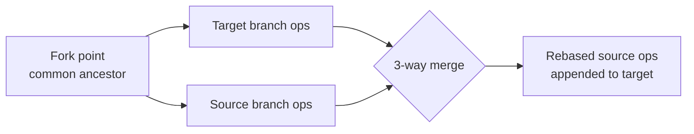

# Merging

**Merging** integrates the edits from one [branch](branching.md) into another. OpStream
performs a **3-way merge** using the fork point as the common ancestor — and crucially, it
reuses the *same* conflict-resolution logic that powers live collaboration.

## Why 3-way, engine-driven

Instead of naive text diffs, the merge is driven by the document's
[engine](../engines/index.md). The concurrent [ops](../reference/interfaces.md) that
accumulated on the source branch since the fork point are **transformed** against the
target branch's history — exactly the `Transform` used to rebase concurrent edits during
real-time collaboration.



This makes the merge:

- **Deterministic** — the same inputs always produce the same result.
- **Intent-preserving** — an insertion at "the end of paragraph 2" lands correctly even if
  paragraph 2 moved on the target.
- **Consistent** — identical semantics to live editing, so there are no surprises.

## Tie-breaking

When two ops genuinely conflict, a `TransformPriority` breaks the tie deterministically.
The default is **`ExistingWins`** — the target branch wins ties.

## Dry-run vs. commit

`MergeBranch` can run in **dry-run** mode: it computes a `MergeReport` (how many ops would
be rebased, how many nullified) **without writing anything**. Commit mode appends the
rebased ops to the target's hot store and [history](history.md), and records a
`merge/{sourceBranch}` milestone.

A host can authorize previews liberally but restrict commits — both share the `MergeBranch`
command, distinguished by the `dryRun` argument in
[`IDatabaseCommandAuthorizer`](../reference/configuration.md#authorization).

## Requires a merge driver

Merge only works for engine types that have a driver registered:

```csharp
services.AddOpStream()
    .UseVersioningMerge<TextDocument, TextOp>("text");
```

Without it, `MergeBranch` fails with *"No merge driver registered for engine type…"*.

## See also

- [Branching](branching.md) — the lines being merged.
- [Engines overview](../engines/index.md) — the `Transform` that drives the merge.
- [Versioning](versioning.md) — tag a merge result to bookmark it.
