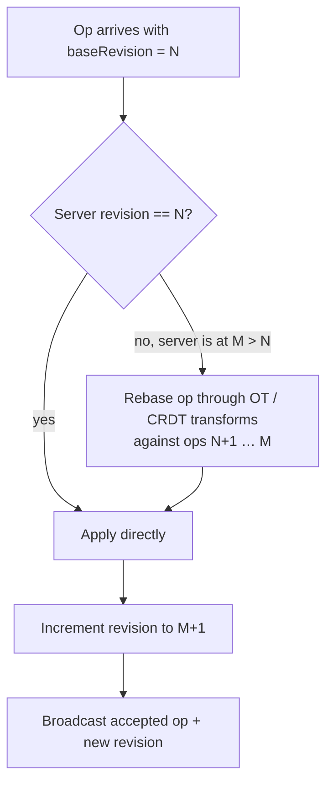

# Revision

The **revision** is a monotonic counter, one per [document](document.md), equal to the
index of the **last accepted [op](../reference/interfaces.md)**. It is the linchpin that
lets many clients edit the same document at once without locking each other out.

## How it enables lock-free editing

Every client sends its `baseRevision` with each op — the revision the client *believed*
was current when it produced the edit. On the server:

If the server is ahead of the client (someone else's edits landed first), the server
**rebases** the incoming op through the [engine's](../engines/index.md) `Transform` so the
edit's *intent* survives, then applies it and bumps the revision. The client later receives
the authoritative ops and converges to the same state.

This is the essence of [Operational Transformation](../engines/text-ot.md) and the CRDT
engines: each client optimistically edits its local revision `N`, and the server
reconciles concurrent work deterministically.

## Properties

- **Monotonic** — only ever increases; never reused.
- **Per document** — branches each maintain their own counter.
- **Authoritative on the owner** — the single live [Session](session.md) on the owning
  node holds the canonical value, which is why all ops route there.

## Where revisions show up

- As the **fork point** when [branching](branching.md).
- As the pinned target of a [version tag](versioning.md).
- As the boundary for [Snapshots](../operations/snapshots.md) and
  [compaction](compaction.md).

## See also

- [Session](session.md) — arbitrates the counter under the apply lock.
- [Snapshot](../operations/snapshots.md) — checkpoints a specific revision.
- [Engine contracts](../reference/interfaces.md) — the `Transform` used to rebase.
