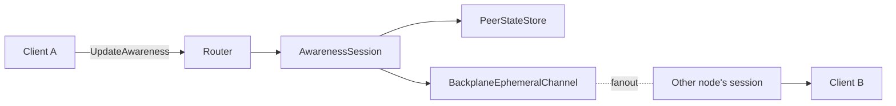

# Awareness

Live presence layer — cursors, selections, "user is typing", avatar dots.
**Ephemeral**: broadcast in real-time but never persisted to the op log.

## What it is

Every connected peer publishes an arbitrary JSON payload — its
"awareness state". The server keeps the latest payload per peer for ~30
seconds, fans changes out to other peers on the same document, and drops
stale entries automatically.

Awareness has its own pipeline separate from `IDocumentSession`:



## Building blocks

Awareness is built from three reusable primitives that other ephemeral
engines (future Undo / Redo of presence, hover overlays, …) can reuse:

| Primitive | Responsibility |
|---|---|
| `IEphemeralEngine<TState>` | Pure: `Merge` / `IsExpired` / `IsNoOp`. |
| `IPeerStateStore<TState>` | Concurrent per-peer in-memory store. |
| `IEphemeralChannel<TState>` | Cluster fan-out via the backplane. |

`AwarenessSession` composes them. You don't normally instantiate it
manually — the `DocumentRouter` creates one per active document.

## Wire shape

```json
// Sent by client → server
{ "data": { "cursor": { "line": 12, "col": 4 }, "selection": [12, 4, 12, 9] } }

// Received by other clients
{
  "peerId": "peer-7",
  "data":   { ... },
  "lastUpdated": "2026-05-28T12:34:56Z"
}
```

The `data` blob is opaque to the engine — UI conventions live in your app.

## Sending awareness

From a .NET client:

```csharp
await client.SendAwarenessAsync(JsonSerializer.SerializeToElement(new
{
    cursor    = new { line = 12, col = 4 },
    selection = new[] { 12, 4, 12, 9 },
    status    = "typing",
}));
```

## Receiving awareness

```csharp
client.OnReceiveAwareness += peers =>
{
    foreach (var peer in peers)
    {
        Console.WriteLine($"{peer.PeerId} → {peer.Data}");
    }
    return Task.CompletedTask;
};
```

The list includes **every** known live peer on the document (including
the local peer for the initial join snapshot); subsequent updates carry
the delta for the peer that just changed.

## Configuration

```csharp
var options = new AwarenessOptions
{
    Ttl = TimeSpan.FromSeconds(30),    // default: evict after 30s of silence
    CoalesceIdenticalUpdates = true,   // default: skip broadcasts whose payload didn't change
};
```

`CoalesceIdenticalUpdates` uses **structural** JSON equality (objects by
key set independent of order, numbers by value), so `{"x":1}` and
`{ "x": 1 }` correctly coalesce.

## Typed wrapper

For strongly-typed presence payloads:

```csharp
public record CursorPresence(int Line, int Col, string Status);

var session = AwarenessSession.CreateDefault("doc-42", backplane);
var typed = new TypedAwarenessSession<CursorPresence>(session);

await typed.UpdateAsync("peer-1", new CursorPresence(12, 4, "typing"));

foreach (var (peerId, presence, _) in typed.GetStates())
{
    Console.WriteLine($"{peerId}: line {presence?.Line}");
}
```

## What awareness is **not**

- :material-close: **Persistent.** No history, no replay — the peer's
  state is lost when they disconnect or after the TTL.
- :material-close: **Authoritative.** A new peer joining sees the
  current live snapshot; anything that happened before they joined is gone.
- :material-close: **Ordered.** Updates carry timestamps for LWW
  resolution but aren't part of the document's revision sequence.

For anything that needs to survive a refresh or feed back into the
document, model it as a real op on a persisted engine.
