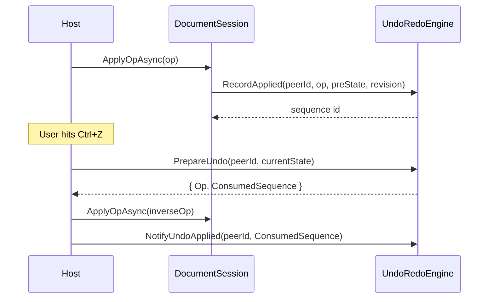

# Undo / Redo Engine

Per-peer undo and redo on top of **any** persisted engine. Transversal —
it composes an `IOpEngine<TDoc, TOp>` and adds stack management for each
connected peer.

## Why a separate engine?

In a collaborative environment, "undo" can't just mean "restore the
previous state" — that would erase work done by other peers since.
The correct semantic is:

> *Generate the inverse of **my** most recent op, transform it through
> every op (mine or theirs) that landed since, and apply that as a new op.*

`UndoRedoEngine<TDoc, TOp>` implements that, with bounded per-peer
undo / redo stacks and concurrency-safe sequencing.

## API at a glance

```csharp
public interface IUndoRedoEngine<TDoc, TOp>
{
    long RecordApplied(string peerId, TOp op, TDoc preState, long revision);

    UndoRedoPreparation<TOp> PrepareUndo(string peerId, TDoc currentState);
    UndoRedoPreparation<TOp> PrepareRedo(string peerId, TDoc currentState);

    void NotifyUndoApplied(string peerId, long consumedSequence);
    void NotifyRedoApplied(string peerId, long consumedSequence);

    bool CanUndo(string peerId);
    bool CanRedo(string peerId);
}
```

## Lifecycle



The host (typically `DocumentSession`) calls `RecordApplied` for every
accepted op. On undo, it asks the engine for a ready-to-apply inverse,
sends it through the normal apply pipeline, and reports back which
sequence id was actually consumed.

!!! warning "Always echo ConsumedSequence back to Notify*"
    `PrepareUndo` may walk past nullified entries on top of the stack
    when a recent op fully absorbed them, returning a deeper candidate.
    `NotifyUndoApplied` removes the entry by sequence id — not by stack
    position — so you **must** pass `prepared.ConsumedSequence`, not
    pop blindly.

## Hooking it into your session

The engine is currently standalone (not auto-wired by
`DocumentSession`). A typical integration:

```csharp
var ur = new UndoRedoEngine<TextDocument, TextOp>(textOtEngine);

// On apply
ur.RecordApplied(peerId, op, preState, newRevision);

// On Ctrl+Z from a peer
var prep = ur.PrepareUndo(peerId, currentState);
if (prep.HasOp)
{
    var result = await session.ApplyOpAsync(peerId, Serialize(prep.Op!), baseRev);
    if (result.Success) ur.NotifyUndoApplied(peerId, prep.ConsumedSequence);
}
```

A future release will fold this into `DocumentSession` with a simple
`EnableUndoRedo()` builder method; for now it's explicit so you can pick
the integration point that fits your transport.

## Configuration

```csharp
new UndoRedoOptions
{
    MaxHistoryDepth = 500,         // cap on the shared log (oldest entries dropped)
    ClearRedoOnNewOp = true,       // standard editor behavior
};
```

## RestampToWin

For LWW-CRDT engines (JSON, Table, Form), cached inverses carry the
timestamps assigned at record-time, which may have been overtaken by
later concurrent writes. `UndoRedoEngine` calls
`engine.RestampToWin(candidate, currentState)` as the **final step** of
`PrepareUndo`/`Redo` so the inverse always wins LWW at Apply time.

Engines that don't use timestamp-based LWW (OT engines, the move-log Tree
CRDT) inherit the default identity implementation — no override needed.

## Compatible engines

| Engine | Compatible? | Notes |
|---|---|---|
| `TextOtEngine` | :material-check: | OT positional rebase handles concurrency. |
| `RichTextEngine` | :material-check: | OT positional rebase + attribute restore. |
| `TreeCrdtEngine` | :material-check: | Move-log absorbs stale timestamps. |
| `JsonCrdtEngine` | :material-check: | Uses `RestampToWin`. |
| `TableCrdtEngine` | :material-check: | Uses `RestampToWin`. |
| `FormOtEngine` | :material-check: | Uses `RestampToWin`. |

## Limitations

- **Bounded history.** Once `MaxHistoryDepth` is exceeded, the oldest
  entries are dropped. Per-peer stacks tolerate dangling references —
  they're skipped at PrepareUndo time.
- **Not persisted.** Stacks live in the session's RAM. If a peer
  reconnects (new session), undo history starts fresh.
- **Single-process scope.** In a multi-node cluster, the undo / redo
  stacks live on the document's owner node. They survive ownership
  hand-offs only if you persist them yourself; we plan first-class
  cluster-safe persistence in a future release.
