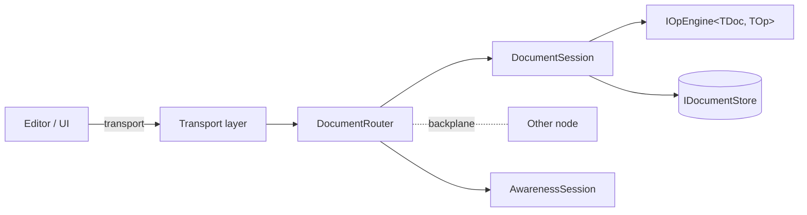

# OpStream

**A real-time collaborative editing toolkit for .NET applications.**

Bring Google-Docs-style co-editing to any document type your app already
owns — without rewriting your authentication, your storage, or your editor.

[Get started in 5 minutes :material-arrow-right:](getting-started/quickstart.md){ .md-button .md-button--primary }
[Browse the engines :material-arrow-right:](engines/index.md){ .md-button }

---

## What OpStream gives you

- **Eight production-ready engines** for the document shapes you actually ship —
  plain text, rich text, JSON, hierarchical trees, tables, forms, presence,
  and per-peer undo / redo.
- **Three transports** (SignalR, WebSockets, gRPC) — pick the one that
  already fits your stack.
- **Eight storage backends** (EF Core, SQL Server, PostgreSQL, MySQL,
  SQLite, MongoDB, Redis, in-memory) behind one `IDocumentStore` contract.
- **Multi-node scaling** via the Redis backplane — flip a single
  `UseRedisBackplane()` call and your single-node setup becomes a cluster.
- **OpenTelemetry traces and metrics out of the box** — every op is a span,
  every store call is timed, every backplane publish is counted.
- **A DI-first builder API** that follows the standard ASP.NET Core
  conventions: `Use*()` replaces, `Add*()` accumulates.

## Mental model in one diagram

You write the **engine** (or pick a built-in one), wire the **transport**
that fits your client, point at a **storage** backend, and let OpStream do
the rest. Replace any layer when production demands it.

## When to use OpStream

| You want… | OpStream is a good fit |
|---|---|
| Multiple users editing the same document at the same time | :material-check: |
| Live cursors, selections, "user is typing" presence | :material-check: |
| Per-peer undo / redo that respects other peers' work | :material-check: |
| Offline / re-sync support driven by an op log | :material-check: |
| Working with your existing ASP.NET Core auth and storage | :material-check: |
| Going multi-node without rewriting your app | :material-check: |
| A standalone WYSIWYG editor — no collaboration | :material-close: use Quill / TipTap directly |
| A pub/sub messaging backbone | :material-close: use NATS / Kafka / Redis directly |

## Next steps

- :material-package-down: **[Install the packages](getting-started/installation.md)**
  Pick the engine, transport, and storage packages you need.

- :material-rocket-launch: **[5-minute quickstart](getting-started/quickstart.md)**
  Hello-world collaborative text editor.

- :material-school: **[Core concepts](getting-started/concepts.md)**
  Documents, ops, revisions, peers, and the engine lifecycle.

- :material-book-open-page-variant: **[Browse the engines](engines/index.md)**
  Choose the right algorithm for your document shape.

