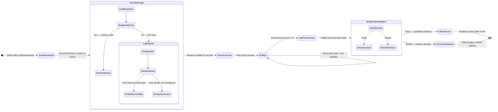
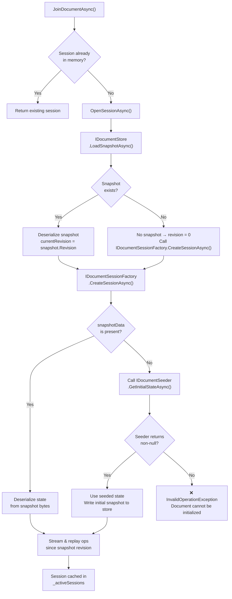
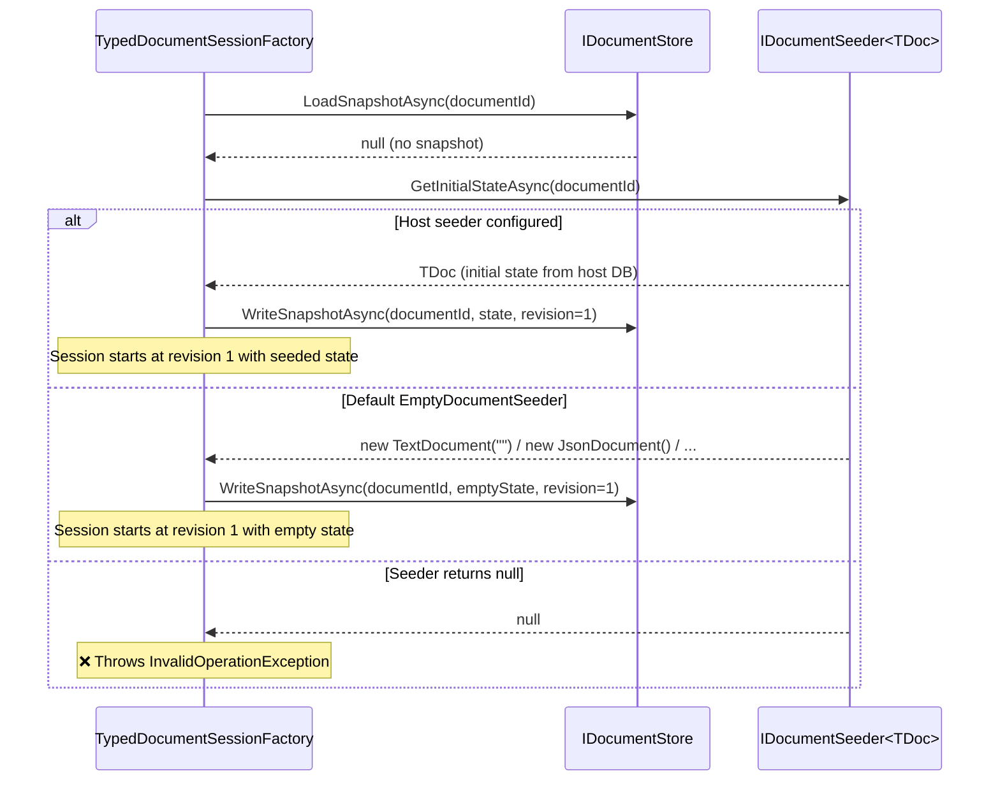
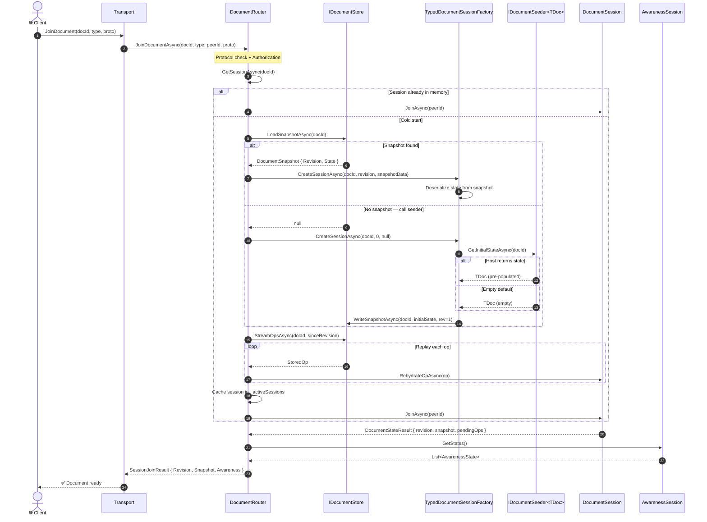
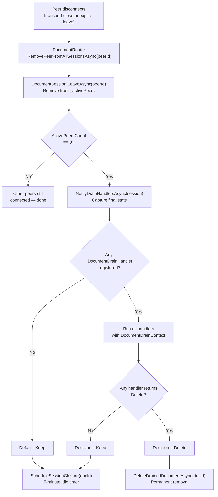
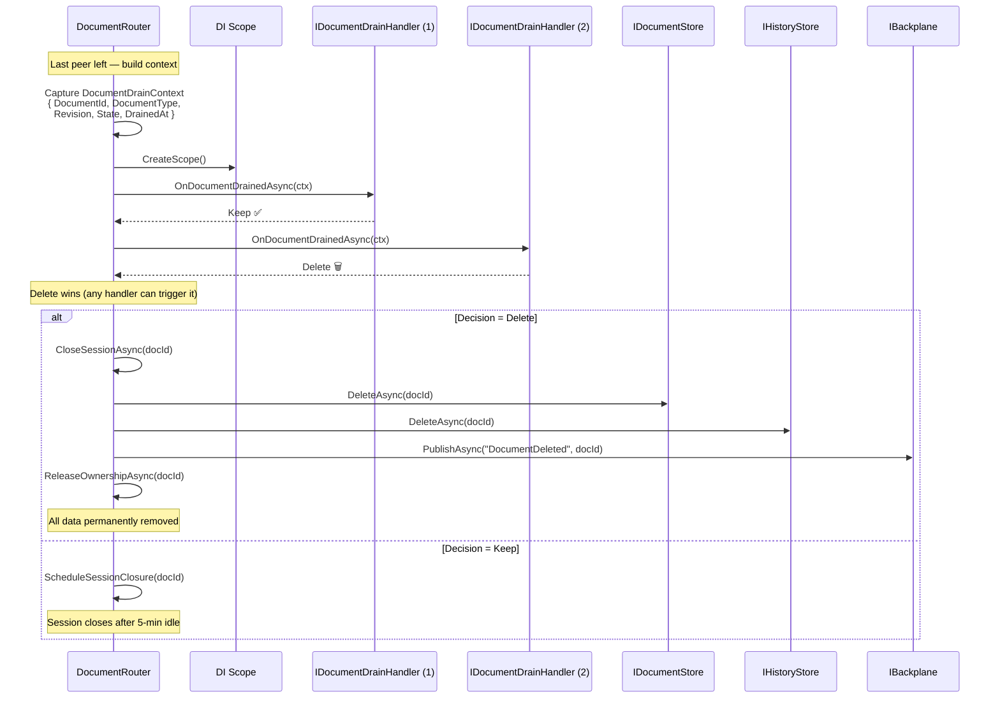
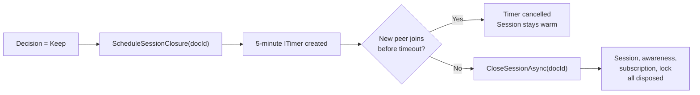
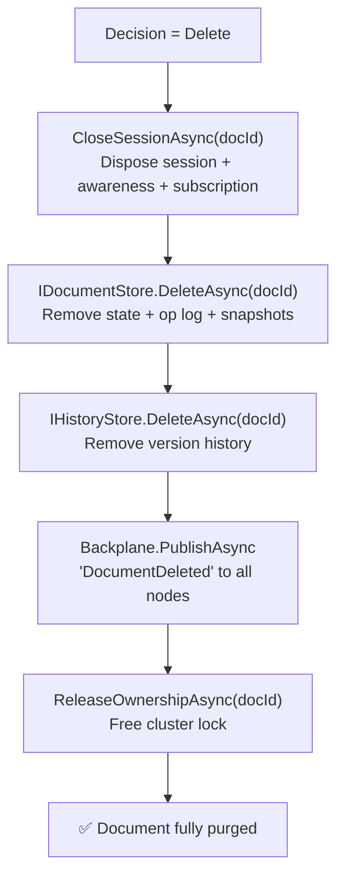
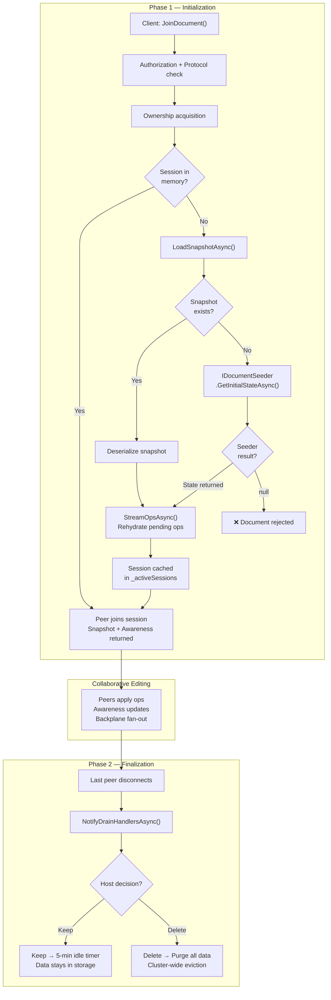

# Document Lifecycle — Initialization & Finalization

This page describes the **complete lifecycle of a collaborative document** inside
OpStream: from the moment the first peer sends a `JoinDocument` request, through
collaborative editing, to the moment all peers leave and the host decides what
happens with the document's data.

!!! info "Scope"
    This document focuses on the **initialization** (join + session opening +
    seeding) and **finalization** (drain + host decision + cleanup) phases. For
    the step-by-step detail of the first join transport handshake, see
    [First User Join Flow](first-join-flow.md).

---

## High-level lifecycle overview



---

## Phase 1 — Initialization (Join)

When a client calls `JoinDocument(documentId, documentType, protocolVersion)`,
the request travels through the transport layer (SignalR, WebSocket, or gRPC)
and reaches `DocumentRouter.JoinDocumentAsync`. The router orchestrates the
following decision tree to obtain or create the document session.

### 1.1 · Session resolution



### 1.2 · The Document Seeder

The **seeder** is the extension point that allows the host application to
inject the initial state of a brand-new document — one that has never been
stored in OpStream's persistence layer.



#### Registering a custom seeder

```csharp
services.AddOpStream()
    .UseSeeder<TextDocument, MyTextSeeder>();
```

```csharp
public class MyTextSeeder : IDocumentSeeder<TextDocument>
{
    private readonly MyDbContext _db;

    public MyTextSeeder(MyDbContext db) => _db = db;

    public async ValueTask<TextDocument?> GetInitialStateAsync(
        string documentId, CancellationToken ct)
    {
        var entity = await _db.Documents
            .FindAsync(new object[] { documentId }, ct);

        if (entity is null)
            return null; // ← reject creation

        return new TextDocument(entity.Content);
    }
}
```

!!! tip "When the seeder returns `null`"
    Returning `null` from the seeder rejects the document creation entirely.
    The client will receive an error. Use this to prevent users from opening
    documents that don't exist in your domain.

#### Default behaviour — `EmptyDocumentSeeder`

If the host **does not** register a custom seeder, OpStream uses the built-in
`EmptyDocumentSeeder<TDoc>`. It creates a type-appropriate empty document:

| Document type | Empty state |
|---|---|
| `TextDocument` | `""` (empty string) |
| `RichTextDocument` | `{}` (empty rich-text document) |
| `Json_Document` | `{}` (empty JSON document) |
| `FormDocument` | `{}` (empty form) |
| `TableDocument` | `{}` (empty table) |
| `TreeDocument` | `{}` (empty tree) |

---

### 1.3 · Complete initialization sequence

The following diagram shows the full path from `JoinDocument` to the client
receiving the initial state, covering all three document-origin scenarios:
existing in storage, seeded by host, or created empty.



---

## Phase 2 — Finalization (Drain)

When the **last peer** disconnects from a document, the document "drains".
OpStream notifies the host application with the final state and lets the host
decide what should happen next.

### 2.1 · Peer disconnect flow



### 2.2 · The Drain Handler

The `IDocumentDrainHandler` is the host's opportunity to capture the final
document state and decide its fate.



#### Registering a drain handler

```csharp
services.AddOpStream()
    .AddDocumentDrainHandler<PersistAndDeleteHandler>();
```

```csharp
public class PersistAndDeleteHandler : IDocumentDrainHandler
{
    private readonly MyDbContext _db;

    public PersistAndDeleteHandler(MyDbContext db) => _db = db;

    public async ValueTask<DocumentDrainDecision> OnDocumentDrainedAsync(
        DocumentDrainContext ctx, CancellationToken ct = default)
    {
        // Save the final state to the host's own database
        var entity = await _db.Documents.FindAsync(
            new object[] { ctx.DocumentId }, ct);

        if (entity is not null)
        {
            entity.Content = Encoding.UTF8.GetString(ctx.State.Span);
            entity.LastRevision = ctx.Revision;
            entity.UpdatedAt = ctx.DrainedAt;
            await _db.SaveChangesAsync(ct);
        }

        // Tell OpStream to delete the document data
        return DocumentDrainDecision.Delete;
    }
}
```

!!! warning "Delete is permanent"
    When a drain handler returns `DocumentDrainDecision.Delete`, OpStream
    removes **all** data associated with the document: current state, op log,
    snapshots, and history. This is irreversible. Make sure you have persisted
    the final state before returning `Delete`.

### 2.3 · The `DocumentDrainContext`

The context record passed to every drain handler contains:

| Field | Type | Description |
|---|---|---|
| `DocumentId` | `string` | The id of the document that drained |
| `DocumentType` | `string` | The engine type discriminator (e.g. `"text"`, `"json"`) |
| `Revision` | `long` | The final accepted revision |
| `State` | `ReadOnlyMemory<byte>` | The full, serialized document state (UTF-8 JSON) |
| `DrainedAt` | `DateTimeOffset` | UTC timestamp of the drain event |

### 2.4 · Keep path — idle timeout

When no drain handler requests deletion (or no handlers are registered at
all), the document follows the **Keep** path:



The document data **remains in storage** and can be reopened at any time by a
future `JoinDocument` call. The 5-minute idle timer prevents memory leaks when
documents go quiet.

### 2.5 · Delete path — permanent removal

When any drain handler returns `DocumentDrainDecision.Delete`:



The cluster-wide broadcast ensures that **every node** drops any cached state
for this document. If a client tries to join the document after deletion, a
fresh session will be created from scratch (going through the seeder again).

---

## Complete lifecycle diagram



---

## Summary

| Phase | What happens | Key extension point |
|---|---|---|
| **Join — document exists in storage** | Snapshot loaded, ops replayed, session opened | — |
| **Join — new document, seeder configured** | `IDocumentSeeder<TDoc>.GetInitialStateAsync()` provides initial state | `UseSeeder<TDoc, TSeeder>()` |
| **Join — new document, no seeder** | `EmptyDocumentSeeder` creates a type-appropriate empty document | Default behaviour |
| **Last peer leaves — Keep** | Session scheduled for closure after 5-minute idle period | — |
| **Last peer leaves — Delete** | All document data permanently removed, cluster notified | `AddDocumentDrainHandler<THandler>()` |

---

## Related pages

<div class="grid cards" markdown>

- :material-login: **[First User Join Flow](first-join-flow.md)**
  Step-by-step detail of the transport handshake and session creation.

- :material-graph: **[Architecture overview](../architecture.md)**
  The layered model and how every component fits together.

- :material-database: **[Storage](../storage/index.md)**
  How snapshots and op logs are persisted.

- :material-scale-balance: **[Backplane](../operations/backplane.md)**
  How owner nodes are elected and how ops are fanned out in a cluster.

- :material-cog: **[Configuration (DI)](../reference/configuration.md)**
  Full reference for the builder API and all `Use*` / `Add*` methods.

</div>
