# First User Join Flow

This page traces in detail **every step that executes** when the very first
peer connects to a document — from the raw WebSocket/SignalR handshake all the
way to the moment the client receives the document snapshot and awareness
state.

!!! tip "Why "first user" specifically?"
    When a second (or later) peer joins, the `DocumentSession` and
    `AwarenessSession` are already warm in memory on the owner node.  The
    *first* join is the interesting case: it triggers cold-start storage
    reads, ownership acquisition, and the creation of all in-memory session
    objects from scratch.

---

## High-level overview

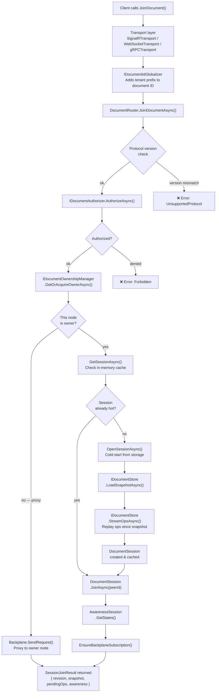

---

## Step-by-step walkthrough

### 1 · Transport handshake

The client invokes the **`JoinDocument`** method over whichever transport it
uses. All three transports funnel into the same `DocumentRouter`.

=== "SignalR"

    ```csharp
    // SignalRTransport.cs
    [HubMethodName(OpStreamConstants.HubMethods.JoinDocument)]
    public async Task<SessionJoinResult> JoinDocument(
        string documentId, string documentType, int clientProtoVersion)
    {
        string globalDocId = globalizer.ToGlobalId(documentId);   // ← step 2
        var peerId = Context.ConnectionId;

        var result = await router.JoinDocumentAsync(
            globalDocId, documentType, peerId, clientProtoVersion);

        if (!result.Success) throw new HubException(result.ErrorMessage);

        await Groups.AddToGroupAsync(peerId, globalDocId);  // ← SignalR group

        return result.Value!;
    }
    ```

    The connection ID (`Context.ConnectionId`) is used as the **peer ID** for
    the entire session lifetime.

=== "WebSocket / gRPC"

    WebSocket and gRPC transports follow the same pattern: extract a unique
    peer ID from the connection context and call `DocumentRouter.JoinDocumentAsync`.

---

### 2 · Document ID globalisation (multi-tenancy)

Before the router sees the document ID, `IDocumentIdGlobalizer` prepends the
current tenant identifier.

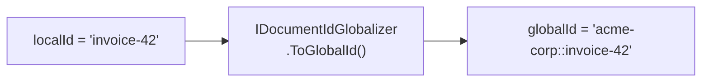

This ensures that `invoice-42` in tenant **acme-corp** and `invoice-42` in
tenant **beta-inc** are stored and routed as completely separate documents —
with zero application-level code required from the engine or the storage layer.

---

### 3 · Protocol version check

`DocumentRouter.JoinDocumentAsync` immediately validates the client's protocol
version against the server constant (`ProtocolVersions.Current = 1`).

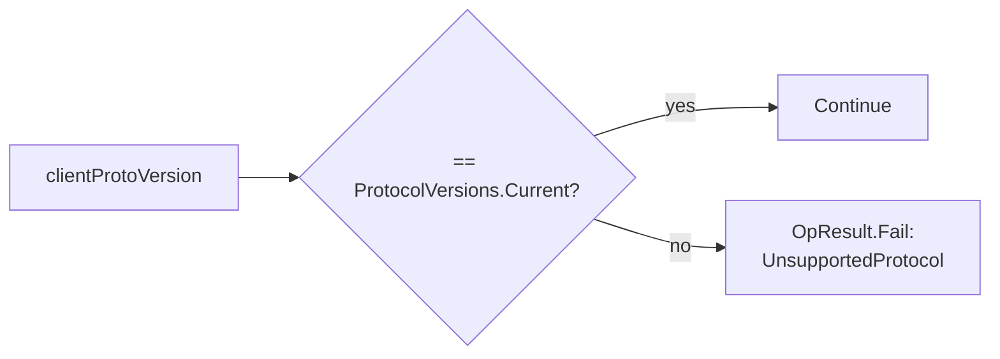

Mismatched clients receive an error immediately — before any storage or
ownership work happens.

---

### 4 · Authorization

For **non-proxied** requests (i.e. the request originated from a real client,
not forwarded from a peer node), the router calls `IDocumentAuthorizer`:

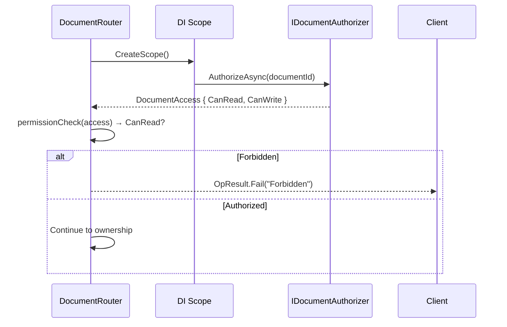

The `IDocumentAuthorizer` is **your code** — OpStream ships a default that
permits everything, and you replace it with any identity/RBAC logic you need
(`services.UseAuthorization<MyAuthorizer>()`).

---

### 5 · Ownership acquisition

This is the **cluster-critical** step.  The router asks the ownership manager:
*"which node should own this document?"*

```mermaid
sequenceDiagram
    participant R as DocumentRouter
    participant OM as IDocumentOwnershipManager
    participant BP as IBackplane

    R->>OM: GetOrAcquireOwnerAsync(documentId, thisNodeId)
    OM-->>R: ownerNodeId

    alt Single-node (LocalDocumentOwnershipManager)
        Note over OM: Always returns thisNodeId — no external call
    else Multi-node (Redis-backed)
        Note over OM: SET NX in Redis; returns existing owner or claims ownership
    end

    R->>R: ownerNodeId == backplane.NodeId?
```

| Mode | Ownership manager | Behaviour |
|---|---|---|
| **Single node** | `LocalDocumentOwnershipManager` | Always returns the local node ID — zero network hops |
| **Multi-node** | `RedisDocumentOwnershipManager` | Atomically claims ownership via Redis `SET NX`; returns existing owner if already claimed |

---

### 6a · Owner path — cold-start session creation

When this node is the owner **and** no warm session exists in memory, the
router calls `OpenSessionAsync`.

```mermaid
sequenceDiagram
    participant R as DocumentRouter
    participant Store as IDocumentStore
    participant Factory as IDocumentSessionFactory
    participant Session as DocumentSession

    R->>Store: LoadSnapshotAsync(documentId)
    Store-->>R: DocumentSnapshot? { Revision, State }

    Note over R: snapshot?.Revision ?? 0 → currentRevision

    R->>Factory: CreateSessionAsync(documentId, currentRevision, snapshotData)
    Factory-->>R: new DocumentSession (engine initialized from snapshot)

    R->>Store: StreamOpsAsync(documentId, sinceRevision: currentRevision)

    loop For each StoredOp after snapshot
        Store-->>R: StoredOp { Revision, Payload }
        R->>Session: RehydrateOpAsync(storedOp)
        Session->>Session: engine.Apply(state, op); CurrentRevision++
    end

    R->>R: _activeSessions[documentId] = newSession
```

**What happens when there is no snapshot and no ops?**

`LoadSnapshotAsync` returns `null` → `currentRevision = 0`.  
`StreamOpsAsync(documentId, 0)` yields no rows.  
The factory creates the session with the **engine's empty initial state**
(e.g. `""` for text, `{}` for JSON).  
This is the *brand-new document* path.

**What happens when there is a snapshot but no subsequent ops?**

The factory restores state from `snapshotData` at `snapshot.Revision`.  
`StreamOpsAsync` yields no additional rows.  
The session is ready immediately without replaying any ops.

**What happens when there are ops after the snapshot?**

Each `StoredOp` is passed to `RehydrateOpAsync`, which deserialises the op
payload and calls `engine.Apply` inside the serialization lock, advancing
`CurrentRevision` step by step until the session is fully caught up.

---

### 6b · Non-owner path — proxy to owner node

When this node is **not** the owner, it forwards the request to the owner via
the backplane:

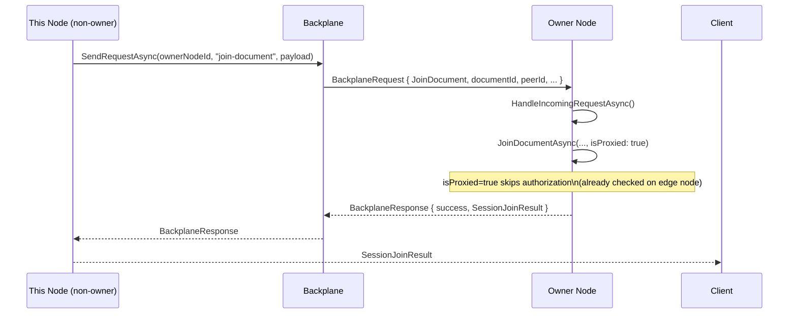

The `isProxied: true` flag is critical: the owner node skips the authorization
call because the edge node already verified permissions.

---

### 7 · Peer joins the warm session

With the session guaranteed to exist (either already warm or just opened),
`DocumentSession.JoinAsync` is called:

```csharp
// DocumentSession.cs
public Task<DocumentStateResult> JoinAsync(string peerId, CancellationToken ct = default)
{
    _activePeers.TryAdd(peerId, 0);
    _logger.LogInformation("Peer {PeerId} joined document {DocId} ...", ...);

    var stateBytes = JsonSerializer.SerializeToUtf8Bytes(_currentState, ...);
    return Task.FromResult(
        new DocumentStateResult(CurrentRevision, stateBytes, Array.Empty<ReadOnlyMemory<byte>>()));
}
```

The peer is added to `_activePeers` (a `ConcurrentDictionary<string, int>`) and
the **full current state** is serialised to JSON as the initial snapshot for
this client.

---

### 8 · Awareness state snapshot

Immediately after the document join, the router retrieves the current presence
state of all already-connected peers:

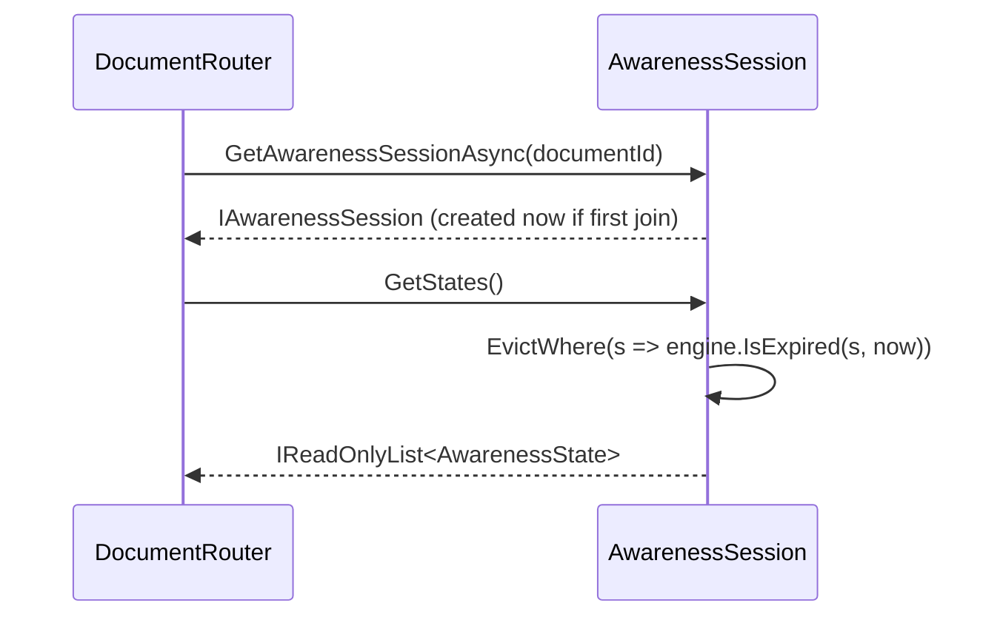

For the **first** peer, `GetStates()` returns an empty list — there are no
other peers yet.  The awareness session itself is created lazily at this point
and stored in `_activeAwareness`.

---

### 9 · Backplane subscription

The last step before returning the result is ensuring the local node is
subscribed to backplane events for this document:

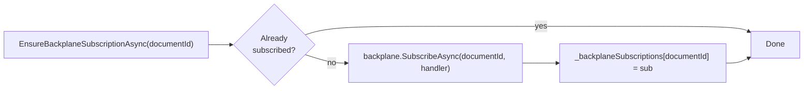

When an op is applied by the owner node (possibly in the future when more
peers are connected), the owner publishes to the backplane.  The subscription
registered here ensures that **this node's connected clients** (via
`SignalRBackplaneRelay` or the equivalent) will receive the broadcast.

---

### 10 · Result assembly and client response

The router assembles a `SessionJoinResult` from all the pieces collected above:

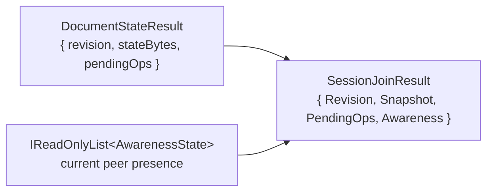

The transport layer serialises `SessionJoinResult` back to the client.  The
client now has:

| Field | What the client does with it |
|---|---|
| `Revision` | Sets its local revision counter — all subsequent ops are based from here |
| `Snapshot` | Initialises the local document state (text string, JSON object, …) |
| `PendingOps` | Reserved for future use; currently always empty |
| `Awareness` | Populates the initial presence UI (avatars, cursors, …) |

---

## Complete sequence diagram

The following diagram combines all the steps above into a single, end-to-end
view.  It shows the **first user, new document** path — the most complete
case, touching every component.

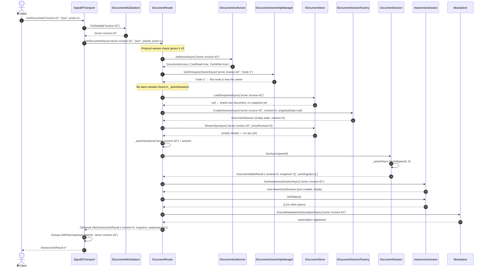

---

## Edge cases

### Document already exists in storage

If `LoadSnapshotAsync` returns a snapshot (e.g. the document was last
active yesterday and a snapshot was taken when the last peer left), the
flow diverges at step 6:

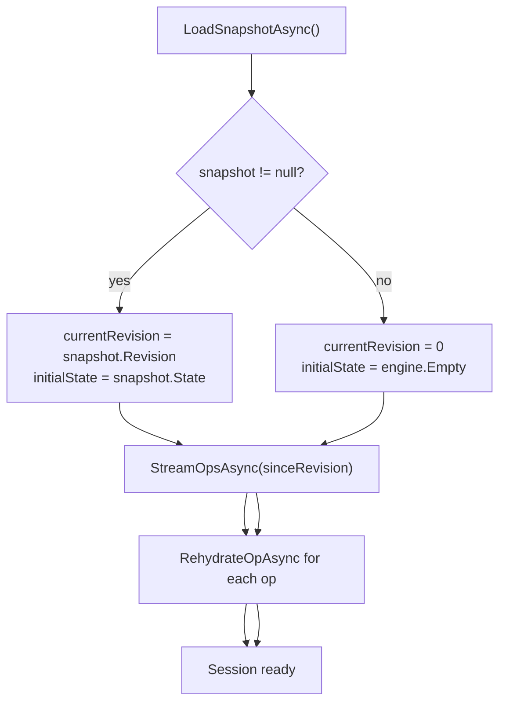

### Owner node is a different node (multi-node cluster)

When Redis ownership returns a **different** node ID, this node becomes a
*proxy node* for this join request.  The join is forwarded over the backplane,
the owner executes steps 6–9, and the result travels back through the
backplane to this node and then to the client.  From the client's perspective
the response is identical.

### Session lock contention

`OpenSessionAsync` is protected by a per-document `SemaphoreSlim`.  If two
peers arrive simultaneously for the same cold document, only one call opens
the session; the second will find it in `_activeSessions` when the lock is
released and skip the storage reads entirely.

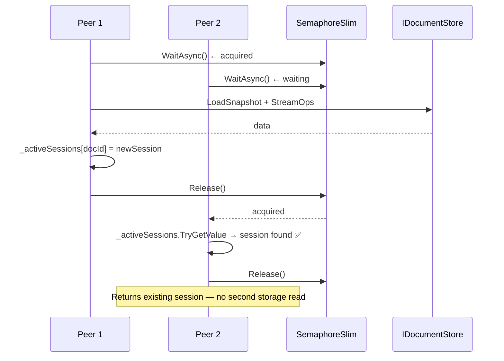

---

## Objects created on first join

| Object | Where stored | Lifetime |
|---|---|---|
| `DocumentSession<TDoc, TOp>` | `DocumentRouter._activeSessions` | Until last peer leaves + 5-minute idle timeout |
| `AwarenessSession` | `DocumentRouter._activeAwareness` | Same as document session |
| `SemaphoreSlim` (per doc) | `DocumentRouter._sessionLocks` | Same as document session |
| `IAsyncDisposable` backplane sub | `DocumentRouter._backplaneSubscriptions` | Same as document session |

All four are cleaned up together by `CloseSessionAsync`, which is triggered by
`ScheduleSessionClosure` when `ActivePeersCount` drops to zero.

---

## Related pages

<div class="grid cards" markdown>

- :material-graph: **[Architecture overview](../architecture.md)**
  The layered model and how every component fits together.

- :material-database: **[Storage](../storage/index.md)**
  How snapshots and op logs are persisted.

- :material-scale-balance: **[Backplane](../operations/backplane.md)**
  How owner nodes are elected and how ops are fanned out in a cluster.

- :material-eye: **[Awareness engine](../engines/awareness.md)**
  The ephemeral presence layer built on top of sessions.

</div>
