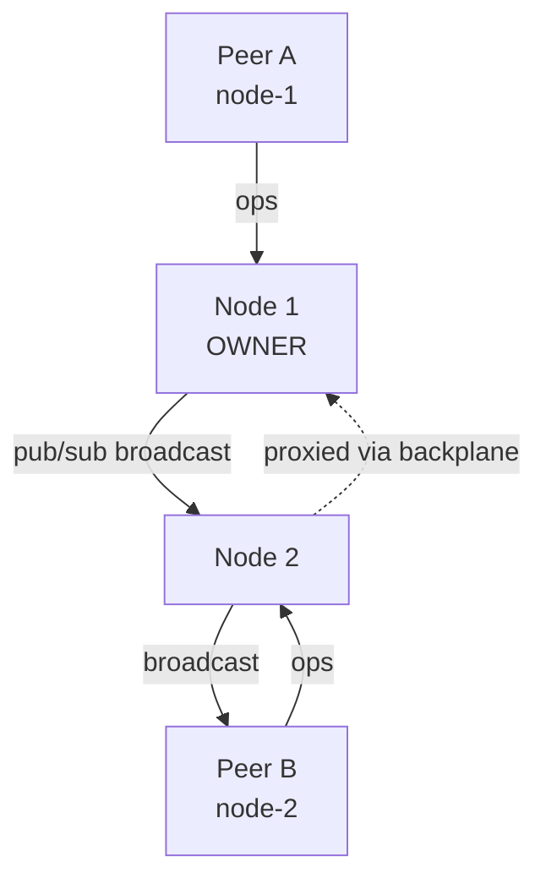

# Backplane (scaling out)

The **backplane** is OpStream's cluster fabric: it fans op-applied
notifications and awareness updates across nodes, and coordinates which
node currently owns each document.

## Single node — default

`AddOpStream()` registers `LocalBackplane` — an in-process fan-out:

- :material-check: Peers on the same node receive each other's ops.
- :material-close: There's no second node, so no cross-node fan-out happens.

You can run multiple processes on the same machine with `LocalBackplane`
— but they won't share state. Use it for single-instance deployments,
dev, and tests.

## Multi-node — Redis backplane

Add the package and a single line:

```bash
dotnet add package OpStream.Server.Backplane.Redis
```

```csharp
builder.Services
    .AddOpStream()
    .UseRedisBackplane(builder.Configuration.GetConnectionString("Redis")!);
```

That's enough for full multi-node operation:

| Concern | How the Redis backplane handles it |
|---|---|
| Cross-node op fan-out | Pub/sub channel per document. |
| Document ownership | Distributed lock with a TTL lease. |
| Routed requests | RPC over Redis pub/sub with response correlation. |
| Awareness | Same pub/sub channel, separate message type. |

## Configuration

```csharp
builder.Services.AddOpStream()
    .UseRedisBackplane(options =>
    {
        options.ConnectionString = "...";
        options.KeyPrefix        = "opstream:";       // default
        options.OwnershipLeaseTtl = TimeSpan.FromSeconds(30);  // default
    });
```

## Ownership model

At any moment, **exactly one** node owns a given document. The owner is
the only one that:

- Holds the in-memory `DocumentSession` for that document.
- Acquires the apply lock.
- Talks to storage.

If a peer connects to a non-owner node, the router on that node
**proxies** the request via `IBackplane.SendRequestAsync(...)` to the
owning node. The proxy is transparent — your client never sees it.

If the owner crashes, the ownership lease expires (default 30 s) and any
surviving node can claim ownership on the next join.



## Performance notes

- The Redis backplane uses **one pub/sub channel per document** —
  scales naturally to millions of channels because Redis pub/sub is
  cheap.
- Awareness updates are coalesced at the engine boundary; a peer that
  sends 60 cursor pings/sec to the same payload doesn't cause 60
  broadcasts.
- Ownership transitions trigger a session-load round-trip; for very
  short-lived documents, prefer warming up the owner with a sticky
  routing policy in your load balancer.

## Single-node-explicit

If you want to be explicit that no multi-node is expected, register the
default backplane by name:

```csharp
services.AddOpStream().UseLocalBackplane();
```

This is identical to the implicit default but documents the intent.

!!! deprecated "`UseNoopBackplane()`"
    The old `UseNoopBackplane()` did **nothing** at all — broke
    single-node fan-out and was a footgun. It's kept as an obsolete
    alias for `UseLocalBackplane()` and will be removed in v1.0.

## Custom backplanes

`IBackplane` has four methods (`Subscribe`, `Publish`, `SendRequest`,
`RegisterRequestHandler`). Implement them against NATS / Kafka / Kafka /
RabbitMQ / Azure Service Bus and register as a singleton **after**
`AddOpStream()`.

PRs for first-class providers are welcome — start from
[`OpStream.Server.Backplane.Redis`](https://github.com/OpStreamCollab/OpStream/tree/main/src/OpStream.Server.Backplane.Redis)
as the canonical example.
